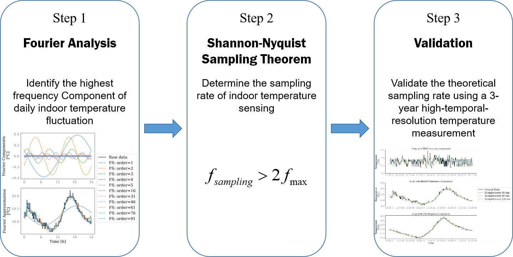
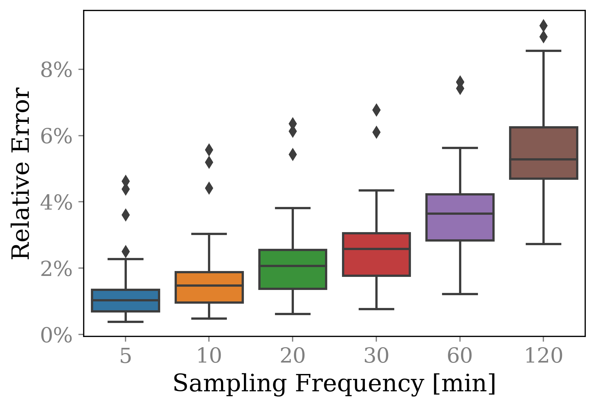

# Building-Sampling-Rate

This is the official repository to determine the suitable sampling rate for building data based on Fourier Analysis and Nyquist-Shannon Sampling Theorem. The details of this work can be found in the following paper:

> *Wang, Z., 2022. How frequent should we measure the indoor thermal enviorment: an investigation based on Fourier Analysis and Nyquist-Shannon Sampling Theorem. Submitted to Applied Energy*

<!--- [[paper]](https://doi.org/10.1016/j.adapen.2021.100061) --->

# Overview
This study tackles a fundamental but overlooked question in indoor environmental sensing: what is the most suitable sampling rate for temperature measurements, which is able to capture the full periodic attributes of temperature variation while avoiding unnessary resource waste. We proposed a three step approach to determine the suitable sampling rate based on Fourier Analysis and Nyquist-Shannon Sampling Theorem. This method was applied on a dataset that measured indoor temperature of 50 thermal zones for 3 years. 



We found in more than 90% of thermal zones investigated in this study, the highest frequency is less than 1/(60*20) Hz, which means the sampling rate of 10 min is adequate. The validation results show that: when the sampling rate is 10 min, the relative error is smaller than 3% for 47 out of 50 thermal zones; when the sampling rate is 30 min, the relative error is smaller than 4.5% for 48 of thermal zones. We also found the marginal improvement of increasing the sampling rate from every 30 min to every 5 min is not significant. Based on the above analysis, we recommended the sampling rate of 10 min for most indoor environmental monitoring. The sampling rate of 30 min is also acceptable if the energy management of IoT device is a major concern. 



We believe the findings of this study can help design building energy management system and determine battery capability of IoT devices.


# Code Usage
### Clone repository
```
git clone https://github.com/WalterZWang/Building-Sampling-Rate.git
cd Building-Sampling-Rate
```

### Unzip the data
```
unzip data/zone_temp_exterior_raw data
mv zone_temp_exterior_raw.csv data/
```


### Set up the environment
Set up the virtual environment with your preferred environment/package manager.

The instruction here is based on **conda**. ([Install conda](https://docs.anaconda.com/anaconda/install/))
```
conda create --name Building-Sampling-Rate python=3.9 -c conda-forge -f requirements.txt
conda activate Building-Sampling-Rate
```


### Repository structure
``bin``: Runnable programs, including Python scripts and Jupyter Notebooks

``bin\util``: Utility functions used in the Jupyter Notebooks

``data``: Raw data used in this repo

``docs``: Manuscript submitted version, and figures generated by the script

### Running
You can replicate our experiments, generate figures and tables used in the manuscript using the Jupyter notebooks saved in ``bin``: `Section 3.1 Fourier analysis on typical days.ipynb`, `Section 3.1 Identify the highest frequency.ipynb`, `Section 3.3 Validation.ipynb`

# Feedback

Feel free to send any questions/feedback to: [Zhe Wang](mailto:cezhewang@ust.hk )

# Citation

If you use our code or find this work helpful, please cite us as follows:

<!---  

```
@article{wang2021alphabuilding,
  title={AlphaBuilding ResCommunity: A multi-agent virtual testbed for community-level load coordination},
  author={Wang, Zhe and Chen, Bingqing and Li, Han and Hong, Tianzhen},
  journal={Advances in Applied Energy},
  volume={4},
  pages={100061},
  year={2021},
  publisher={Elsevier}
}
```

--->